# hey, I'm Kena 👋

**ML Software Engineer** · building intelligent systems, one model at a time

---

## 📊 Metrics

| Lines of Code | Commit Activity |
|:---:|:---:|
|  |  |

---

## 🗣️ Most Used Languages

---

## 🌱 Currently Learning

| Area | Topics |
|------|--------|
| 🤖 AI/ML | LLMs, RAG pipelines, Data Science |
| 🗄️ Databases | MSSQL, PostgreSQL |
| ☁️ Infrastructure | Cloud Computing, Automation |
| 🤖 Bots | Discord Bots |